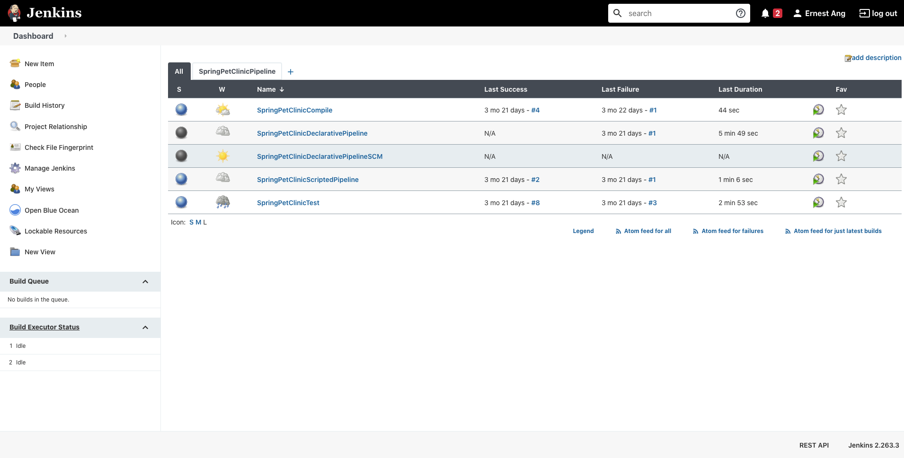

# Jenkins CI/CD DevOps Tutorial:

- Need to install [build pipeline plugin](https://plugins.jenkins.io/build-pipeline-plugin/)

- Run Jenkins locally and view pipeline built manually

- Can also refer to history builds/logs to see details of pipelines and what they do

- Repository name change, take note and apply changes accordingly

# Getting Started: 

- [Coursera Guided Project](https://www.coursera.org/projects/cicd-using-jenkins)

- [Spring PetClinic Sample Application](https://github.com/spring-projects/spring-petclinic)

# Jenkins Server:

- `brew services start jenkins-lts`

- `http://localhost:8080/` (Default port 8080, [click here to see more](https://www.jenkins.io/doc/book/system-administration/reverse-proxy-configuration-iptables))

# Created 6 pipelines:

1. Single Compile Stage (SpringPetClinicCompile)

2. Single Test Stage (SpringPetClinicTest)

3. Pipeline linking Compile Stage + Test Stage (SpringPetClinicPipeline) - using [build pipeline plugin](https://plugins.jenkins.io/build-pipeline-plugin/)

4. Multi-Staged Pipeline using Scripted Pipeline

5. Multi-Staged Pipeline using Declarative Pipeline

6. Multi-Staged Pipeline using Declarative Pipeline specified on GitHub

